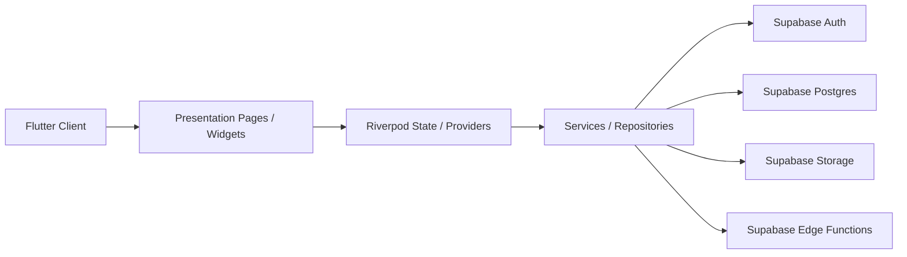

# FitnessApp

中文说明: [README.md](./README.md)

[](https://github.com/wuzhan-hua/FitnessApp/actions/workflows/ci.yml)
[](https://flutter.dev/)
[](https://supabase.com/)
[](./LICENSE)
[](#tech-stack)

A focused fitness tracking app built with Flutter and Supabase for structured workout and nutrition logging.

FitnessApp is a real-world multi-platform reference implementation for workout and nutrition tracking. It combines a Flutter client, Supabase backend, deployment scripts, documentation, screenshots, tests, and contributor-facing repository setup into one maintainable open-source project.

## Why This Project Matters

This repository is more than a demo app. It is a practical `Flutter + Supabase` reference for developers who want to study or build structured logging products in health, fitness, and data-driven personal tools.

It covers the full chain from UI and state management to backend integration, database migrations, edge functions, and Web deployment. That makes it useful not only for end users, but also for independent developers and small teams looking for a reusable engineering baseline.

## Core Features

- Structured workout logging with sessions, exercises, sets, reps, and weights
- Nutrition logging with daily summaries and food-library-based entry flows
- Calendar-based history review for workout and diet records
- Analytics views for training trends and activity summaries
- Auth flows including sign-in, sign-up, guest upgrade, and account management
- Admin-oriented catalog management for exercises and food data
- Flutter Web deployment support with repository-provided scripts

## Tech Stack

- `Flutter` for iOS, Android, and Web clients
- `Riverpod` for state management and dependency injection
- `Supabase` for auth, database, storage, and edge functions
- `fl_chart` for analytics visualization
- `Vercel` for Web deployment

## Screenshots

The screenshots below are taken from the current project and grouped by product area.

### Home

Shows the training overview, primary entry points, and dashboard density.

| Home-1 | Home-2 |
| --- | --- |
|  |  |

### Training

Shows session editing, exercise arrangement, and set logging workflow.

| Training-1 | Training-2 |
| --- | --- |
|  |  |

### Nutrition

Shows meal logging, nutrition summaries, and food entry experience.

| Nutrition-1 | Nutrition-2 |
| --- | --- |
|  |  |

### Calendar

Shows date-based review of training and diet history.

| Calendar-1 |
| --- |
|  |

### Exercise Library

Shows exercise search, selection, and catalog browsing capabilities.

| Exercise Library-1 |
| --- |
|  |

### Profile

Shows account, profile, settings, and personal entry points.

| Profile-1 | Profile-2 |
| --- | --- |
|  |  |

## Architecture



The architecture keeps UI, state, and data access separated. Flutter handles the cross-platform client, Riverpod manages state and dependencies, and the data layer connects to Supabase auth, database, storage, and edge functions. This structure helps keep product code maintainable while making the repository easier to study and extend.

## Roadmap

### Completed

- [x] Workout tracking
- [x] Nutrition logging
- [x] Calendar-based history review
- [x] Training analytics dashboard
- [x] Auth and profile basics
- [x] Flutter Web deployment support

### In Progress

- [ ] Flutter mobile app polish
- [ ] Workout logging UX improvements
- [ ] Nutrition logging UX improvements
- [ ] Better admin management workflows

### Long-term Exploration

- [ ] AI workout recommendation
- [ ] AI nutrition planning
- [ ] Wearable device integration
- [ ] Open API

## Local Setup

### Requirements

- Flutter SDK
- Dart SDK
- A working Supabase project

### Environment Variables

The app expects these public runtime values:

- `SUPABASE_URL`
- `SUPABASE_ANON_KEY`

### Run Locally

For Web development:

```bash
flutter run \
  --dart-define=SUPABASE_URL=your_supabase_url \
  --dart-define=SUPABASE_ANON_KEY=your_supabase_anon_key \
  -d chrome
```

The repository already includes a local CanvasKit setup for Flutter Web to reduce failures caused by external `gstatic` dependencies.

## Deploy

- Repository: [wuzhan-hua/FitnessApp](https://github.com/wuzhan-hua/FitnessApp)
- Deploy target: self-deployable with the included `Vercel` configuration
- Current public demo: no long-term public demo URL is provided at the moment

The repository includes:

- `vercel.json`
- `tool/vercel_prepare.sh`
- `tool/vercel_build.sh`

## Contributing and Project Health

This repository already includes:

- [Contribution Guide](./CONTRIBUTING.md)
- [Code of Conduct](./CODE_OF_CONDUCT.md)
- [Security Policy](./SECURITY.md)
- [Changelog](./CHANGELOG.md)
- Issue templates, PR template, and CI workflow

## License

This project is released under the [MIT License](./LICENSE).
