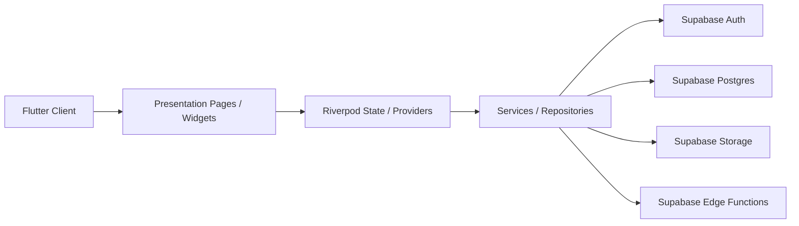

# FitnessApp

[](https://github.com/wuzhan-hua/FitnessApp/actions/workflows/ci.yml)
[](https://flutter.dev/)
[](https://supabase.com/)
[](./LICENSE)
[](#技术栈)

A focused fitness tracking app built with Flutter and Supabase for structured workout and nutrition logging.

一个面向有训练基础用户的健身记录 App 原型，聚焦训练记录效率、结构化数据沉淀与多端访问体验。

项目基于 `Flutter + Supabase` 构建，当前覆盖移动端与 Web 端，定位为轻量、专业、工具型的训练记录应用，而不是跟练或内容消费型产品。

## 为什么这个项目重要

这个仓库不仅仅是一个健身记录 App，也是在中文语境下相对少见的 `Flutter + Supabase` 多端参考实现。它把训练记录、饮食记录、认证流程、用户资料、后台目录管理、数据库迁移、边缘函数和 Web 部署串成了一条完整链路，适合独立开发者、小团队或学习者直接参考、复用和二次开发。

对于开源生态来说，这类“可运行、可部署、可继续维护”的真实项目，比单一功能示例更有复用价值；它既能帮助别人理解产品型 Flutter 应用如何组织，也能为后续的记录类、健康类和数据驱动型应用提供工程样板。

## 项目亮点

- 专注训练记录效率，围绕训练会话、动作、组数、次数、重量等结构化数据展开
- 同时覆盖训练与饮食记录，适合做长期自我追踪
- 基于 `Flutter` 统一多端，适合作为产品原型或二次开发基础
- 后端采用 `Supabase`，认证、数据库、存储与函数能力集中管理
- 已具备 Web 发布能力，便于演示、试用与持续迭代

## 适用人群

- 已有训练习惯，想要更轻量记录工具的用户
- 正在验证健身记录产品方向的独立开发者
- 希望参考 `Flutter + Supabase` 架构的工程实践者

## 当前能力

当前仓库已实现或已具备对应代码支持的能力包括：

- 训练记录：创建、编辑、保存训练会话，支持动作、组数、次数、重量等结构化记录
- 历史回顾：按日历查看训练分布、查看历史训练详情、补录历史训练
- 训练分析：查看训练频率、训练量与阶段趋势图表
- 饮食管理：记录饮食、查看每日汇总、接入食物库数据
- 账户体系：支持登录、注册、访客流程、资料管理与账号相关操作
- 管理能力：包含动作目录、食物目录等后台管理相关页面与服务支持
- Web 发布：内置 Flutter Web 启动适配与 Vercel 部署脚本

## 技术栈

- `Flutter`：统一构建 iOS、Android 与 Web 客户端
- `Riverpod`：状态管理与依赖注入
- `Supabase`：认证、数据库、存储与 Edge Functions
- `fl_chart`：训练分析图表展示
- `Vercel`：Flutter Web 部署与静态站点托管

## 项目截图

以下截图来自当前项目实际页面，按功能分组展示：

### 首页

展示今日训练概览、关键入口和整体信息密度。


### 训练页

展示训练会话编辑、动作编排与组数记录流程。


### 饮食页

展示饮食记录、营养汇总与食物录入体验。


### 日历页

展示训练与饮食在日期维度上的历史分布与回顾能力。


### 动作库页

展示动作检索、动作选择与目录管理基础能力。


### 我的

展示账户、资料、偏好设置与个人入口聚合。


## 技术架构图



架构上，客户端使用 `Flutter` 统一承载多端界面，`Riverpod` 负责状态组织与依赖注入，页面通过 `Services / Repositories` 访问数据层，后端能力集中落在 `Supabase` 的认证、数据库、存储与函数模块中。这样的分层有助于保持页面逻辑简洁，也让后续功能扩展、服务替换和多端复用更稳定。

## Roadmap

### 已完成

- [x] Workout tracking
- [x] Nutrition logging
- [x] Calendar-based history review
- [x] Training analytics dashboard
- [x] Auth and profile basics
- [x] Flutter Web deployment support

### 规划中

- [ ] Flutter mobile app polish
- [ ] 训练记录体验优化
- [ ] 饮食记录体验优化
- [ ] 管理后台能力增强

### 远期探索

- [ ] AI workout recommendation
- [ ] AI nutrition planning
- [ ] Wearable device integration
- [ ] Open API

## 项目结构

项目当前主要目录如下：

```text
lib/
  app/                    应用入口、路由、鉴权壳层
  application/            Provider 与状态控制
  constants/              常量定义
  data/                   services 与 repositories
  domain/                 实体模型
  presentation/           页面与 UI 组件
  theme/                  主题与样式
  utils/                  日志、错误、时间等工具

supabase/
  migrations/             数据库迁移脚本
  functions/              Edge Functions

docs/                     项目文档与展示素材
tool/                     数据导入与部署辅助脚本
web/                      Flutter Web 静态资源
```

## 本地开发

### 环境要求

- Flutter SDK
- Dart SDK
- 可用的 Supabase 项目

### 必要环境变量

本项目运行依赖以下公开配置：

- `SUPABASE_URL`
- `SUPABASE_ANON_KEY`

### 本地启动

移动端或桌面端按常规 Flutter 方式启动即可。Web 调试推荐直接使用以下命令：

```bash
flutter run \
  --dart-define=SUPABASE_URL=你的_SUPABASE_URL \
  --dart-define=SUPABASE_ANON_KEY=你的_SUPABASE_ANON_KEY \
  -d chrome
```

当前仓库已经对 Flutter Web 的 CanvasKit 加载方式做了适配，优先使用本地资源，避免默认依赖 `gstatic` 导致的白屏问题。

## Web 部署

项目已内置 Vercel 部署配置，适合作为 Web 演示环境或轻量正式发布方案。

## Demo / Deploy

- Repository: [wuzhan-hua/FitnessApp](https://github.com/wuzhan-hua/FitnessApp)
- Deploy: 可基于仓库内置 `Vercel` 配置自助部署
- Current public demo: 暂未提供长期公开演示地址，避免不稳定环境影响体验

仓库中已包含以下文件：

- `vercel.json`
- `tool/vercel_prepare.sh`
- `tool/vercel_build.sh`

部署流程可简化为：

1. 将仓库导入 Vercel
2. 配置环境变量 `SUPABASE_URL` 与 `SUPABASE_ANON_KEY`
3. 使用仓库内置脚本完成 Flutter Web 构建
4. 输出目录指定为 `build/web`

如果 Vercel 后台需要手动填写配置，可使用以下值：

- Install Command: `bash tool/vercel_prepare.sh`
- Build Command: `bash tool/vercel_build.sh`
- Output Directory: `build/web`

## Supabase 相关

项目后端基于 Supabase，仓库中已包含：

- 数据库迁移脚本
- 账号注册、访客升级、注销相关 Edge Functions
- 用户资料、训练记录、饮食记录、目录数据等服务层接入代码

这使项目既可以作为独立原型继续演进，也适合作为 `Flutter + Supabase` 多端应用的参考实现。

## 贡献方式

欢迎通过以下方式参与项目：

- 提交 Bug 报告或功能建议
- 认领并修复 Issue
- 提交 Pull Request 改进文档、体验或实现

开始贡献前，建议先阅读：

- [贡献指南](/Users/mac/Projects/fitness_Projects/fitness_client/CONTRIBUTING.md)
- [行为准则](/Users/mac/Projects/fitness_Projects/fitness_client/CODE_OF_CONDUCT.md)
- [安全策略](/Users/mac/Projects/fitness_Projects/fitness_client/SECURITY.md)
- [变更记录](/Users/mac/Projects/fitness_Projects/fitness_client/CHANGELOG.md)

## 开源协议

本项目采用 [MIT License](/Users/mac/Projects/fitness_Projects/fitness_client/LICENSE) 开源。

这意味着你可以在遵守协议条款的前提下自由地使用、修改、分发和商用本项目代码。

## 导入与维护脚本

### 动作库导入

如需将 `free-exercise-db` 导入到当前 Supabase 项目，先执行对应 migration，再运行导入脚本：

```bash
SUPABASE_URL=你的_SUPABASE_URL \
SUPABASE_SERVICE_ROLE_KEY=你的_SUPABASE_SERVICE_ROLE_KEY \
FREE_EXERCISE_DB_LOCAL_ROOT=你的_free-exercise-db_本地目录 \
dart run tool/import_free_exercise_db.dart
```

可选环境变量：

- `FREE_EXERCISE_DB_LOCAL_ROOT`：必填，本地 `free-exercise-db` 仓库根目录
- `FREE_EXERCISE_DB_SOURCE_VERSION`：默认 `main`
- `SUPABASE_EXERCISE_BUCKET`：默认 `exercise-reference`
- `FREE_EXERCISE_DB_BATCH_SIZE`：默认 `50`

当前脚本默认要求使用本地 `free-exercise-db` 仓库，不再依赖 `raw.githubusercontent.com` 下载 JSON 和图片。

### 动作库中文同步

如需将第三方中文数据文件按 `id` 回写到 `exercise_catalog_items.name_zh` 与 `exercise_catalog_items.instructions_zh`，执行：

```bash
SUPABASE_URL=你的_SUPABASE_URL \
SUPABASE_SERVICE_ROLE_KEY=你的_SUPABASE_SERVICE_ROLE_KEY \
FREE_EXERCISE_ZH_JSON_PATH=你的_free-exercise-db-zh.json_本地路径 \
dart run tool/update_exercise_name_zh.dart
```

兼容环境变量：

- `FREE_EXERCISE_NAME_ZH_SOURCE`：旧变量名，语义等同于 `FREE_EXERCISE_ZH_JSON_PATH`

### 食物库导入

如需将 `assets/datasets/china-food-composition` 导入到当前 Supabase 项目，先执行对应 migration，再运行导入脚本：

```bash
SUPABASE_URL=你的_SUPABASE_URL \
SUPABASE_SERVICE_ROLE_KEY=你的_SUPABASE_SERVICE_ROLE_KEY \
dart run tool/import_china_food_composition.dart
```

可选环境变量：

- `CHINA_FOOD_COMPOSITION_DIR`：默认 `assets/datasets/china-food-composition`
- `CHINA_FOOD_IMPORT_BATCH_SIZE`：默认 `100`
